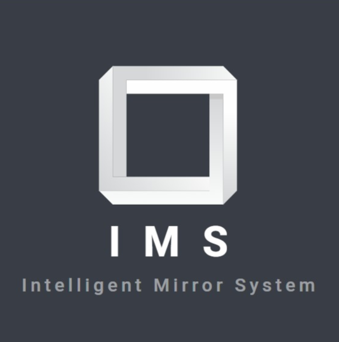
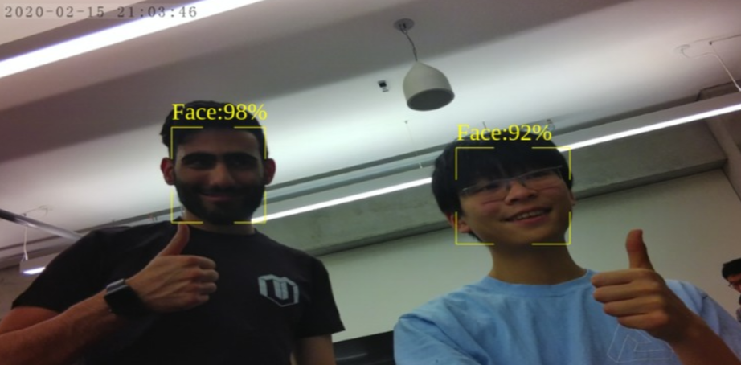
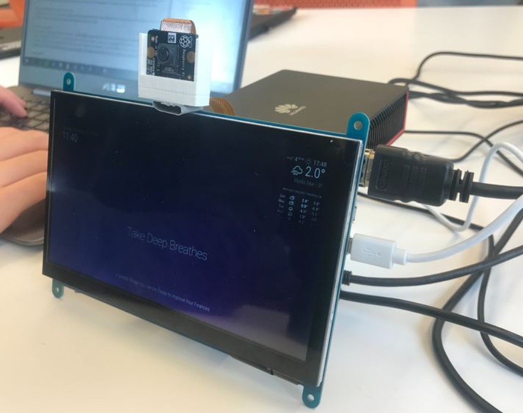

# MakeUofT
This is a repository for the makeathon, MakeUofT 2020.   
This repository does not contain the code for the coding challenge that we particpated in and won.  
We won the **Huawei Ascend Innovation Award** for the best usage of Huawei’s AI Development Board ‘Atlas 200 DK’.

**Inspiration**  
Our inspiration came from our curiosity and excitement to make a simple house-hold item into a high-tech tool that changes the way we interact with everyday things. We wanted to maximize the functionality of an everyday object while implementing innovative technology. We specifically wanted to focus on a mirror by designing and creating a smart mirror that responds and adapts to its diverse environment.

**What It Does**  
It gives a modern and aesthetic appeal to the room it is implemented in. What makes our Intelligent mirror system smart, is its ability to display any information you want on it. This mirror can be customized to display local weather forecasts, news bulletins, upcoming notifications, and daily quotes. One crucial feature is that it can store the data of medication inside a cupboard, and remind the user to take the specific pills at its predetermined time. It uses facial recognition to detect if a user is in front of the mirror and that will trigger the mirror to start up.

**How I Built It**  
We built our project using Mind Studio for Huawei, Github for sharing the code, Raspian to program the Raspberry Pi, and a JavaScript environment.

**Challenges I Ran Into**  
During the initial brainstorming phase, our group thought of multiple ideas. Unfortunately, due to the large pool of possibilities of ideas, we had a difficult time committing to a single idea. Once we began working on an idea, we resulted in switching only after a couple of hours.

At last, we set on to utilize the Telus Dev Shield. After gaining a major stride of progress, we were left stuck and disappointed when we were unable to set up the environment from the Telus Dev Shield. Although we tried our best to figure out a solution, we were, in the end, unable to do so, forcing us to abandon our idea once again.

Another major barrier we faced was having the Raspberry Pi and the Huawei Atlas 200 DK communicate with each other. Unfortunately, we used all the ports possible on the Raspberry Pi, giving us no room to connect the Atlas.

**Accomplishments That We're Proud Of** 
Finishing the vision recognition model was the standout for the accomplishment of our group while using a trained AI model for facial recognition along with Huawei's Atlas 200 DK.

**What I Learned**  
An important ability we learned over the course of 24 hours was to be patient and overcome challenges that appear nearly impossible at first. For roughly the first half of our making session, our group was unable to make substantial progress. After having frequent reflection and brainstorming sessions, we were able to find an idea that our team all agreed on. With the remaining time, we were able to finalize and product that satisfied our desire of making an everyday item into something truly unique. The second we learned was more on the technical side. Since our team consisted of primarily first years, we were unfamiliar with the hardware offered at the event, and thus, the related software. However, after going through the tutorials and attending the workshops, we were able to learn something new about the Huawei Atlas 200 DK and also the Raspbian OS.

**What's Next for I.M.S (Intelligent, Mirror, System)**  
Create a better physical model with a two-way mirror and LED lights behind the frame Implement with a smart home system (Alexa, Google Home...) Have Personal profiles based on the facial recognition it can be personalized for each person Have voice control to give commands to the mirror, and have a speaker to have responsive feedback

# Images

Logo:  

Facial Recognition:  

User Interface:  

